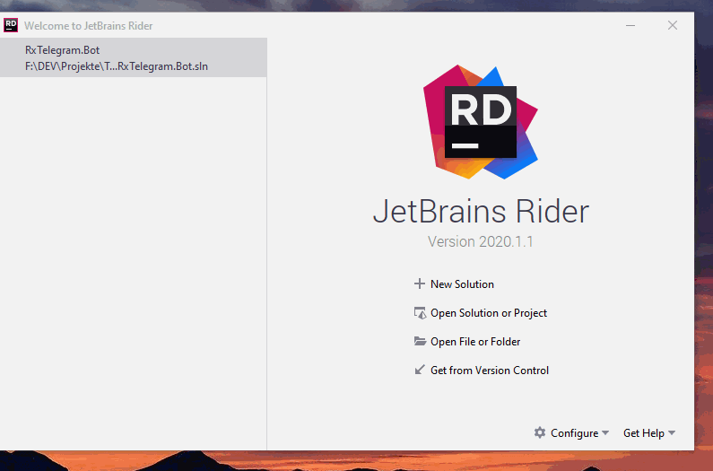
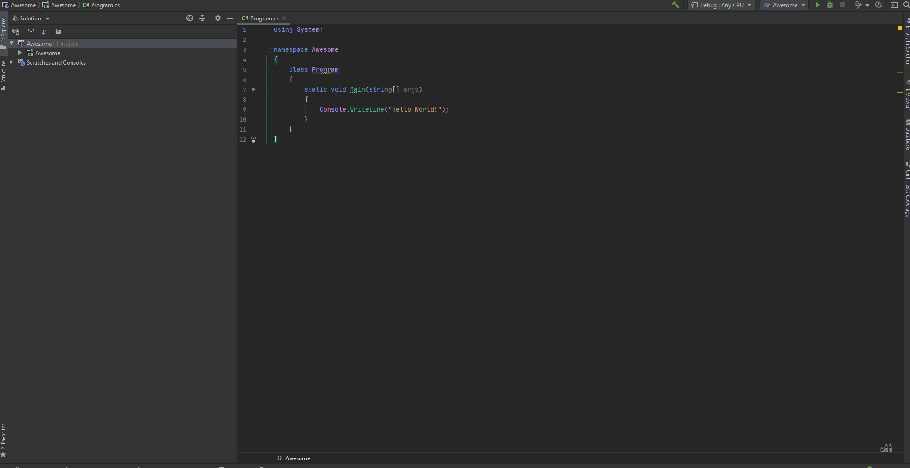
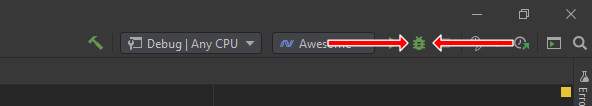

# Quickstart Guide (Rider)

Hey 👋,
thanks for your interested in using [RxTelegram.Bot](https://github.com/RxTelegram/RxTelegram.Bot). This quickstart guide will give you an easy 3 steps solution how to get started with RxTelegram.Bot using your Terminal. __Quickstart guides are also available for the Terminal and Visual Studio.__

## 1. Bot Father

Before we can get started you need to create a Telegram Bot by visiting [@BotFather](https://t.me/BotFather) with any Telegram client and create a new bot. He will give you an access token which you need to authorize your bot at every request, but do not worry we will handle this for you.

## 2. Hello World - by clicking

This Tutotial will not explain how to get Rider installed, but you need a working Rider installation so go and set it up. It is quite simple just ask any search engine and you will find many tutorial or click [here](https://www.jetbrains.com/help/rider/Installation_guide.html) follow the offical tutorial by Jetbrains.

So since you have a running Rider installation, lets begin.

### 2.1 Create a Project

First of all you have to create a new "Console Application" as shown in the video below.


### 2.2 Install RxTelegram.Bot

Now you have to install the [RxTelegram.Bot](https://github.com/RxTelegram/RxTelegram.Bot) Nuget package as shown in the video below.


### 2.3 Paste the code

Open the ```Programm.cs``` file and paste the following content.

> **Replace ACCESS_TOKEN_HERE with the access token Botfaher gave you.**

```csharp
using System;
using RxTelegram.Bot;

namespace Awesome {
    class Program {
        public static void Main () {
            var botClient = new TelegramBot ("ACCESS_TOKEN_HERE");
            var me = botClient.GetMe().Result;
            Console.WriteLine (
                $"Hello, World! I am bot number {me.Id}. My name is {me.FirstName}."
            );
        }
    }
}
```

## 3. Run your programm

The last step is quid simple. Just click on the "Bug" button and your awesome Project will start.


## Troubleshooting

### Invalid Bot Token

```text
Unhandled exception. RxTelegram.Bot.Exceptions.InvalidTokenException: The given bot token is not valid. See "https://core.telegram.org/bots/api#authorizing-your-bot" for further information. Token was: ACCESS_TOKEN_HERE
   at RxTelegram.Bot.BotInfo.ValidateToken(String token)
   at RxTelegram.Bot.BotInfo..ctor(String token)
   at RxTelegram.Bot.TelegramBot..ctor(String token)
   at Awesome.Program.Main() in C:\Users\nikwe\Downloads\asf\Program.cs:line 7
```

If you get an Exception like this it is most likely that you did not replaced the access token in the code sample or you copied the wrong one.
